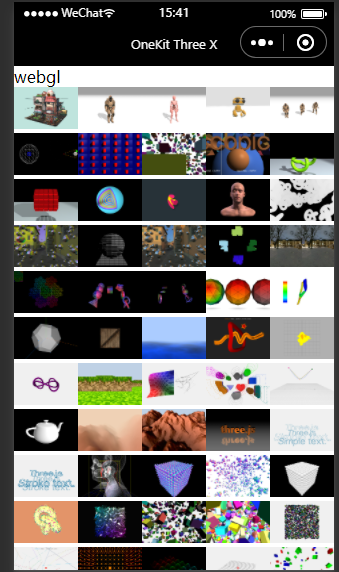
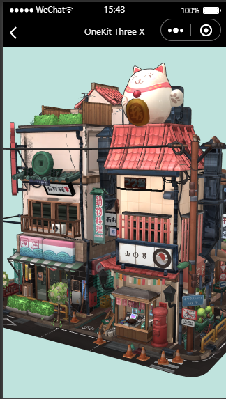

# three-weixin(全网最强)

#### 介绍
全网最强 Three.js 微信小程序版(兼容Uni-App版）。
完美效果，完美移植。
问题反馈（QQ群185654475）

#### 软件架构
完美复刻Three.js
[效果演示](https://www.bilibili.com/video/BV1Qe4y1Z7x2?share_source=copy_web&vd_source=7c04e28e67346c8e44c9b04db22d7631)




#### Demo演示(微信小程序/Uni-App)

1.  克隆或下载本仓库。
2.  在demo根目录，安装依赖

    ```
    npm i
    ```
    
3.  小程序开发工具打开dmo目录。
4.  小程序开发工具顶部菜单->工具->构建npm
5.  编译（刷新）本demo项目。
6.  本项目所需模型资源访问较慢，可从网盘下载后( https://pan.baidu.com/s/1NU-9y6oeUNCUKpFBvvN7Hg?pwd=4077 )，放置到你本地(推荐IIS)或云web服务器，并修改项目访问默认域名（请在小程序代码App.js中设置）

#### 项目使用(微信小程序/Uni-App)

1.  安装

    1.1. 安装依赖

    ```
    npm i dhtml-weixin
    npm i three-weixin
    ```

    1.2.  小程序开发工具顶部菜单->工具->构建npm

    1.3.  编译（刷新）你的项目。

2.  页面UI上加入 

    ```
    <canvas id="canvas_webgl" type="webgl"/>
    ```

3.  代码中，使用three换为使用three-wexin

    ```
    import * as THREE from 'three'
    ```
    更换为
    ```
    import * as THREE from 'three-weixin'
    ```

4.  代码中，替换examples中内容

    ```
    import xxx from 'three/examples/xxx'
    ``` 
    更换为
    ```
    import xxx from './xxx'
    ```

5.  复制你的网页版Three.js项目页面代码(建议Vue2项目)代码到本小程序页面onLoad或onReady中。

    5.1 异步方式

    ```
    Page({
        async onLoad() {
            getApp().canvas = await document.createElementAsync("canvas","webgl");
            //组件中使用 getApp().canvas = await document.createElementAsync("canvas","webgl",this);
            /*你的代码 */
        }
    })
    ```

    5.2 同步方式

    ```
    Page({
        onLoad() {
            document.createElementAsync("canvas","webgl").then(canvas=>{
            //组件中使用 document.createElementAsync("canvas","webgl",this).then(canvas=>{
            getApp().canvas = canvas;
            /*你的代码 */
        })
    })
    ```

6.  所有JS文件，若用到网页对象（如window、document），请在页面顶部添加 
    ```
    import {document,window,self,URL,requestAnimationFrame} from 'dhtml-weixin'
    ```

7.  添加事件

    7.1 页面UI改造为
      ```
     <canvas id="canvas_webgl" type="webgl"
        disable-scroll="true"
        bindtouchcancel="webgl_touchcancel"
        bindtouchend="webgl_touchend"
        bindtouchmove="webgl_touchmove"
        bindtouchstart="webgl_touchstart"
        />
    ```

    7.2 页面代码添加

    ```
    var renderer
    Page({
       webgl_touchcancel(e){
        window.dispatchEvent(e)
        renderer.dispatchEvent(e)
        },
        webgl_touchend(e){
            window.dispatchEvent(e)
            renderer.dispatchEvent(e)
        },
        webgl_touchmove(e){
            window.dispatchEvent(e)
            renderer.dispatchEvent(e)
        },
        webgl_touchstart(e){
            window.dispatchEvent(e)
            renderer.dispatchEvent(e)
        },
        async onLoad(){
             getApp().canvas = await document.createElementAsync("canvas","webgl");
             renderer = new THREE.WebGLRenderer( { antialias: true } );
        }
    })
    ```

8.  本项目所需模型资源访问较慢，可从网盘下载后( https://pan.baidu.com/s/1NU-9y6oeUNCUKpFBvvN7Hg?pwd=4077 )，放置到你本地(推荐IIS)或云web服务器，并修改项目访问默认域名（请在小程序代码App.js中设置）


#### 参与贡献

1.  Fork 本仓库
2.  新建 Feat_xxx 分支
3.  提交代码
4.  新建 Pull Request
