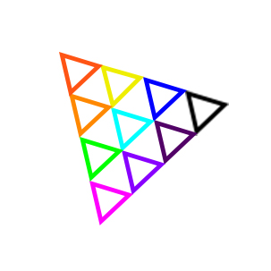

# ThreeX(NPM包/微信小程序插件)
# 支持Ammo（WASM/JS双模式）

#### 介绍
全网第二强(不让用最强) Three.js 微信小程序版(兼容Uni-App版）。
完全免费，完美效果，完美移植。
社群 & 反馈（QQ群185654475）

#### 软件架构
完美复刻Three.js
![所有]](所有.png)

#### 全套示例(微信小程序/Uni-App)

全套Demo、examples、JSM，请访问Gitee搜索three-weixin的plugin_demo文件夹。

#### 项目使用(微信小程序/Uni-App)

1. 项目设置里，不要勾选“上传时，进行代码保护”，不然找不到导出文件threex.js(小程序官方bug)。不要勾选“不校验合法域名、web-view（业务域名）、TLS版本以及HTTPS证书”，并百度搜索“小程序 域名白名单”教程添加您的模型网络url。调试基础库“2.25.0”以上。

2.  安装(npm包方式)

    2.1 安装NPM包
    ```
    npm i three-weixin
    ```

    2.2 点击菜单“工具”，然后点“构建npm”。

    2.3 编译（刷新）你的项目。

    2.4 代码中，使用three库换为使用Three-weixin库

    ```
    import * as THREE from 'three'
    ```
    更换为
    ```
    import * as THREE from 'three-weixin'
    ```

    2.5 项目根目录新建three文件夹，里面新建Three.js文件，内容如下：

    ```
    import * as THREE from 'three-weixin'
    module.exports = THREE
    ```

3.  安装(插件方式)

    3.1 项目根目录，安装依赖：

    ```
    npm i dhtml-weixin
    ```

    3.2 点击菜单“工具”，然后点“构建npm”。
    3.3 项目根目录app.json添加如下内容：

    ```
    "plugins":{
      "ThreeX": {
        "version":"1.1.1",
        "provider": "wx5d6376b4fc730db9",
        "export": "threex.js"
      }
    }
    ```

    3.4 项目根目录添加threex.js文件，内容如下：

    ```
    module.exports = {
        getApp() {
            return getApp()
        },
        getCurrentPages() {
            return getCurrentPages()
        },
        wx_request() {
            return wx.request
        }
    }
    ```

    3.5 项目根目录新建three文件夹，里面新建Three.js文件，内容如下：

    ```
    const THREE = requirePlugin('ThreeX');
    module.exports = THREE
    ```

    3.6  编译（刷新）你的项目。

    3.7 代码中，使用three库换为使用ThreeX插件

    ```
    import * as THREE from 'three'
    ```

    更换为

    ```
    const THREE = requirePlugin('ThreeX');
    ```

4.  页面WXML里加入 

    ```
    <canvas id="canvas_webgl" type="webgl"/>
    ```

5.  页面WXSS里加入

    ```
    page { height:100%; }
    canvas { width:100%; height:100%; }
    ```

6.  复制demo中需要的examples中的文件到你的项目(jsm放在主包或子包根目录)。使用examples的js文件，替换：

    ```
    import xxx from 'three/examples/jsm/yyy'
    ``` 
    更换为
    ```
    import xxx from './jsm/yyy'
    ```

7.  复制你的网页版Three.js项目页面代码(建议Vue2项目)代码到本小程序页面onLoad或onReady中。

    ```
    var requestId // 来自 requestId = requestAnimationFrame()
    Page({
        onLoad() {
            document.createElementAsync("canvas","webgl").then(canvas=>{
            // 组件中使用 document.createElementAsync("canvas","webgl",this)
                const canvas3d = this.canvas = canvas;
                const renderer = this.renderer = new THREE.WebGLRenderer( { canvas:canvas3d, antialias: true } );
                /*你的代码 */
            })
        },
        onUnload(){
            cancelAnimationFrame(requestId)
            this.renderer.dispose()
            this.renderer.forceContextLoss()
            this.renderer.context = null
            this.renderer.domElement = null
            this.renderer = null
       }
    })

    ```

8.  所有JS文件，若用到网页对象（如window、document），请在页面顶部添加 
    ```
    import {document,window,self,URL,requestAnimationFrame,cancelAnimationFrame,Event0} from 'dhtml-weixin'
    ```

9.  添加事件

    9.1 页面UI改造为
      ```
     <canvas id="canvas_webgl" type="webgl"
        disable-scroll="true"
        bindtouchcancel="webgl_touch"
        bindtouchend="webgl_touch"
        bindtouchmove="webgl_touch"
        bindtouchstart="webgl_touch"
        />
    ```

    9.2 页面代码添加

    ```
    import { OrbitControls } from './jsm/controls/OrbitControls0.js';
    Page({
       webgl_touch(e){
            const web_e = Event0.fix(e)
            document.dispatchEvent(web_e)
            window.dispatchEvent(web_e)
            this.canvas && this.canvas.dispatchEvent(web_e)
        },
    })
    ```

10.  模型资源，建议放置到你本地(推荐IIS)或云web服务器，并修改项目访问默认域名（请在小程序代码App.js中设置）


#### 常见问题（FAQ）

1. 图片/材质，按微信小程序要求，尺寸请小于2000x2000，体积小于2M（若图片来自CDN，请在url后边加缩放尺寸参数）。
2. onUnload记得释放资源。
3. 不要app.js在和页面Page({})外部,里存放大数据。
4. Uni-App支持App.js不好，全局配置可能会失效。
5. 部分Android显示GLB模型，若黑屏，请添加环境光和点光源，增加模型粗糙度。
6. OrbitControls请使用OrbitControls0和Event0
